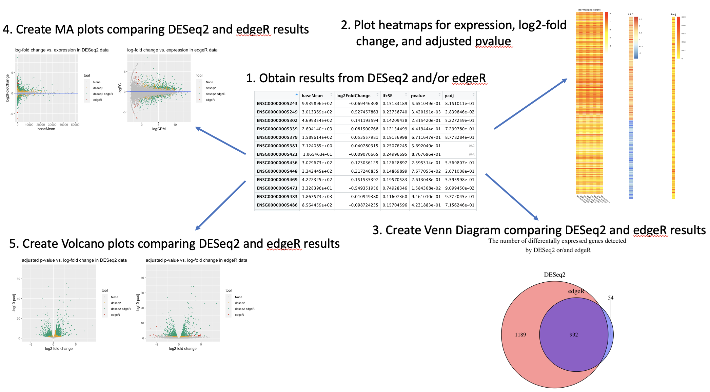

<!-- README.md is generated from README.Rmd. Please edit that file -->

```{r, include = FALSE}
knitr::opts_chunk$set(
  collapse = TRUE,
  comment = "#>",
  fig.path = "man/figures/README-",
  out.width = "100%"
)
```

# DEVisComp

<!-- badges: start -->
<!-- badges: end -->

## Description

`DEVisComp` is an R package for visualizing and comparing the differential expression analysis results from R packages DESeq2 and edgeR. This package provide different plots such as MA plots and Venn diagrams comparing the differntially expressed genes data generated by DESeq2 and edgeR. It can also be used to visualize the pattern of gene expression together with log-fold change and adjusted p-values. In order for the result to be meaningful, the package assumes the results from DESeq2 and edgeR should be created with similar parameters.

The package is developed under R 4.1.1 in Mac.

## Installation

To install the latest version of the package:

``` r
require("devtools")
devtools::install_github("Lori-tan/DEVisComp", build_vignettes = TRUE)
library("DEVisComp")
```

To run the Shiny app:
Under construction

## Overview

``` r
ls("package:DEVisComp")
data(package = "DEVisComp") # optional
```

`DEVisComp` contains 1 functions to visualize the expression analysis results and 3 functions to compare the results created by DESeq2 and edgeR. The *ClusterTogether* function generates 3 heatmaps side-by-side showing the patterns among gene expression, log-fold changes, and adjusted p-values of the differntially expressed genes. The *compVenn* is the function that create a Venn diagram comparing the genes that are marked as differentially expressed by DESeq2 and edgeR. The *compMA* and *compVolcano* generate MA plots and Volcano plots respectively for results created by DESeq2 and edgeR.

``` r
browseVignettes("DEVisComp")
```

An overview of the package is illustrated below. 



## Contributions

The author of the package is Luomeng Tan. The *ClusterTogether* function makes use of pheatmap function from `pheatmap` R package to plot the heatmaps. The `stats` R package is used for calculating the standard deviation between counts in different condition and for calculating the quantile of a vector. The `RColorBrewer` and `grDevices` R packages are used to generate color scale for the heatmaps. The `cowplot` R packages is used to plot mulitple heatmaps into a grid. The *compVenn* makes use of the `VennDiagram` R package. *compMA* and *compVolcano* use `ggplot2` and use `gridExtra` to plot plot multiple plots into one grid. The package uses data from an RNAseq experiment characterize the human airway smooth muscle transcriptome conducted by University of Pennsylvania as examples and exports them as data available to users.

## References

BioRender. (2021). Image created by Tan, L. Retrieved Novemver 15, 2021, from https://app.biorender.com/

Himes et al. (2014). RNA-Seq transcriptome profiling identifies CRISPLD2 as a
  glucocorticoid responsive gene that modulates cytokine function in airway smooth
  muscle cells. *PloS one, 9*(6), e99625.
  https://doi.org/10.1371/journal.pone.0099625

## Acknowledgements

This package was developed as part of an assessment for 2021 BCB410H: Applied Bioinfor- matics, University of Toronto, Toronto, CANADA.
