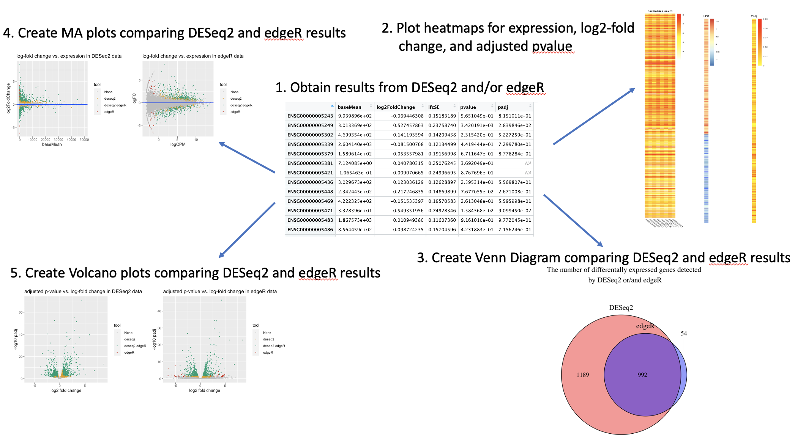

<!-- README.md is generated from README.Rmd. Please edit that file -->

# DEVisComp

<!-- badges: start -->
<!-- badges: end -->

## Description

`DEVisComp` is an R package for visualizing and comparing the
differential expression analysis results from R packages DESeq2 and
edgeR. This package provide different plots such as MA plots and Venn
diagrams comparing the differntially expressed genes data generated by
DESeq2 and edgeR. It can also be used to visualize the pattern of gene
expression together with log-fold change and adjusted p-values. In order
for the result to be meaningful, the package assumes the results from
DESeq2 and edgeR should be created with similar parameters.

The package is developed under R 4.1.1 in Mac.

## Installation

To install the latest version of the package:

``` r
require("devtools")
devtools::install_github("Lori-tan/DEVisComp", build_vignettes = TRUE)
library("DEVisComp")
```

To run the Shiny app: Under construction

## Overview

``` r
ls("package:DEVisComp")
data(package = "DEVisComp") # optional
```

`DEVisComp` contains 1 functions to visualize the expression analysis
results and 3 functions to compare the results created by DESeq2 and
edgeR. The *ClusterTogether* function generates 3 heatmaps side-by-side
showing the patterns among gene expression, log-fold changes, and
adjusted p-values of the differntially expressed genes. The *compVenn*
is the function that create a Venn diagram comparing the genes that are
marked as differentially expressed by DESeq2 and edgeR. The *compMA* and
*compVolcano* generate MA plots and Volcano plots respectively for
results created by DESeq2 and edgeR.

``` r
browseVignettes("DEVisComp")
```

An overview of the package is illustrated below.



## Contributions

The author of the package is Luomeng Tan. The *ClusterTogether* function
makes use of pheatmap function from `pheatmap` R package to plot the
heatmaps. The `stats` R package is used for calculating the standard
deviation between counts in different condition and for calculating the
quantile of a vector. The `RColorBrewer` and `grDevices` R packages are
used to generate color scale for the heatmaps. The `cowplot` R packages
is used to plot mulitple heatmaps into a grid. The *compVenn* makes use
of the `VennDiagram` R package. *compMA* and *compVolcano* use `ggplot2`
and use `gridExtra` to plot plot multiple plots into one grid. The
package uses data from an RNAseq experiment characterize the human
airway smooth muscle transcriptome conducted by University of
Pennsylvania as examples and exports them as data available to users.

## References

Auguie, B. (2017). gridExtra: Miscellaneous Functions for “Grid”
Graphics. R package version 2.3.
<https://CRAN.R-project.org/package=gridExtra>

BioRender. (2021). Image created by Tan, L. Retrieved Novemver 15, 2021,
from <https://app.biorender.com/>

Chen, H. (2021). VennDiagram: Generate High-Resolution Venn and Euler
Plots. R package version 1.7.0.
<https://CRAN.R-project.org/package=VennDiagram>

Himes et al. (2014). RNA-Seq transcriptome profiling identifies CRISPLD2
as a glucocorticoid responsive gene that modulates cytokine function in
airway smooth muscle cells. *PloS one, 9*(6), e99625.
<https://doi.org/10.1371/journal.pone.0099625>

Kolde, R. (2019). pheatmap: Pretty Heatmaps. R package version 1.0.12.
<https://CRAN.R-project.org/package=pheatmap>

Love, M. I., Huber, W., & Anders, S. (2014). Moderated estimation of
fold change and dispersion for RNA-seq data with DESeq2. *Genome
Biology, 15*(12), 550. <https://doi.org/10.1186/s13059-014-0550-8>

Neuwirth, E. (2014). RColorBrewer: ColorBrewer Palettes. R package
version 1.1-2. <https://CRAN.R-project.org/package=RColorBrewer>

R Core Team (2021). R: A language and environment for statistical
computing. R Foundation for Statistical Computing, Vienna, Austria. URL
<https://www.R-project.org/>.

Robinson, M. D., McCarthy, D. J., & Smyth, G. K. (2010). edgeR: A
Bioconductor package for differential expression analysis of digital
gene expression data. *Bioinformatics, 26*(1), 139–140.
<https://doi.org/10.1093/bioinformatics/btp616>

Wickham H. (2016). ggplot2: Elegant Graphics for Data Analysis.
Springer-Verlag New York.

Wilke, C. O. (2020). cowplot: Streamlined Plot Theme and Plot
Annotations for ‘ggplot2’. R package version 1.1.1.
<https://CRAN.R-project.org/package=cowplot>

Zhu, A., Ibrahim, J. G., Love, M. I. (2018). Heavy-tailed prior
distributions for sequence count data: removing the noise and preserving
large differences Bioinformatics

## Acknowledgements

This package was developed as part of an assessment for 2021 BCB410H:
Applied Bioinfor- matics, University of Toronto, Toronto, CANADA.
