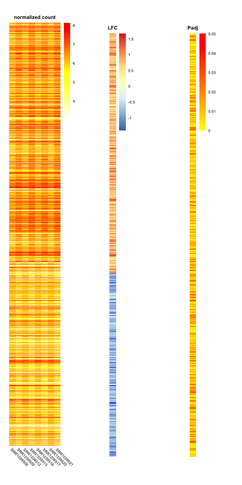
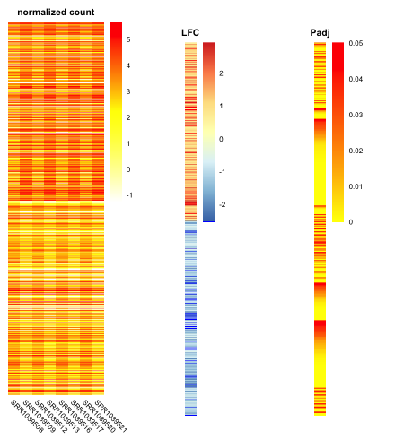
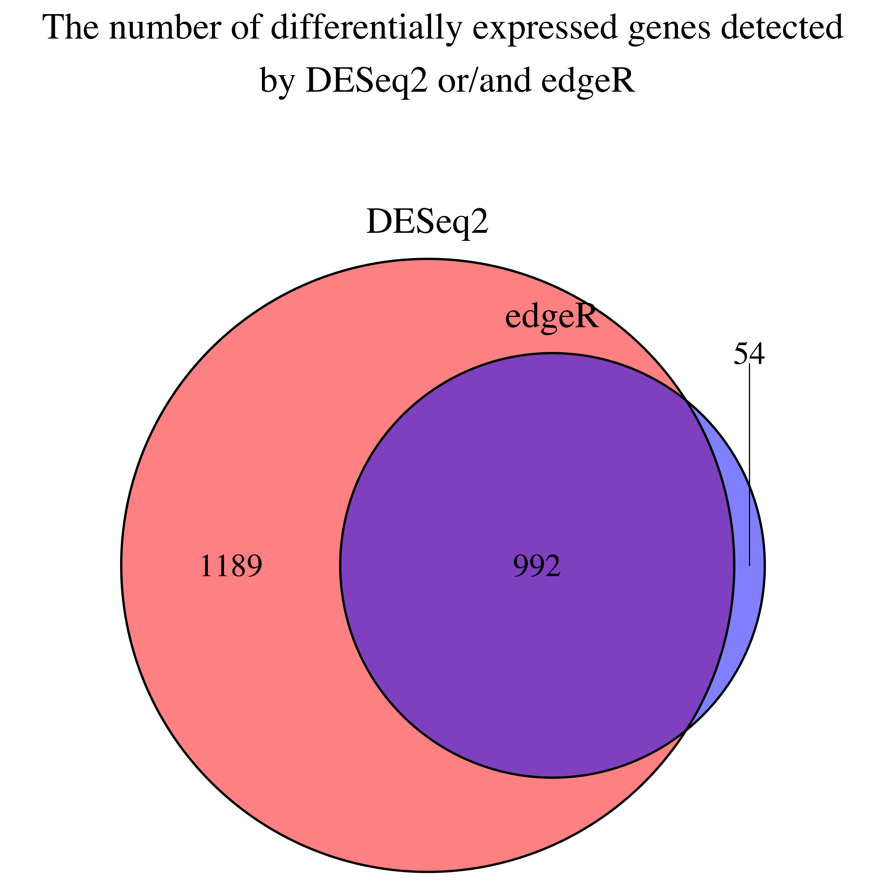
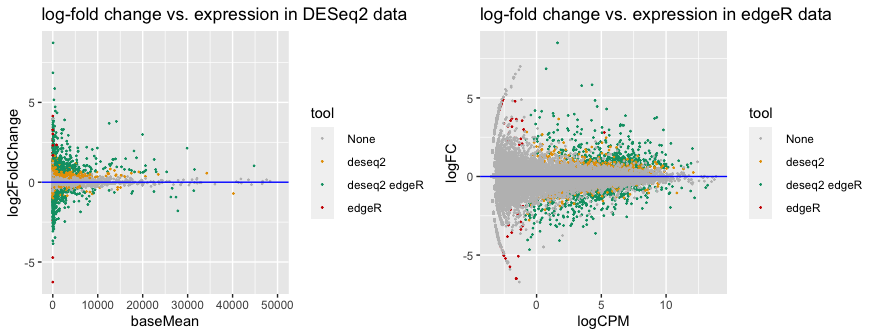
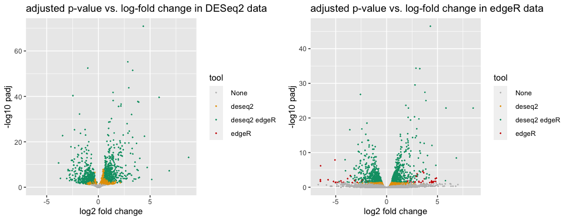

```{r setup, include=FALSE}
library(knitr)
opts_chunk$set(fig.align = "center", 
               out.width = "90%",
               fig.width = 6, fig.height = 5.5,
               dev.args=list(pointsize=10),
               par = TRUE, # needed for setting hook 
               collapse = TRUE, # collapse input & ouput code in chunks
               warning = FALSE)
knit_hooks$set(par = function(before, options, envir)
  { if(before && options$fig.show != "none") 
       par(family = "sans", mar=c(4.1,4.1,1.1,1.1), mgp=c(3,1,0), tcl=-0.5)
})
set.seed(1) # for exact reproducibility
```

## Introduction

`DEVisComp` is an R package for visualizing and comparing the differential expression analysis results from R packages DESeq2 and edgeR. This package provide different plots such as MA plots and Venn diagrams comparing the differntially expressed genes data generated by DESeq2 and edgeR. It can also be used to visualize the pattern of gene expression together with log-fold change and adjusted p-values. In order for the result to be meaningful, the package assumes the results from DESeq2 and edgeR should be created with similar parameters.

To download **DEVisComp**, use the following commands:

``` r
require("devtools")
devtools::install_github("Lori-tan/DEVisComp", build_vignettes = TRUE)
library("DEVisComp")
```

To list all sample functions available in the package:
``` r
ls("package:DEVisComp")
```

To list all sample datasets available in the package:
``` r
data(package = "DEVisComp")
```

<br>

## Quick Start

### Set up
There are 4 functions in the package, and all functions require DESeq2 and/or edgeR outputs as correct inputs. We first used the airway dataset in the package to perform the differential gene expression analysis with standard workflow of DESeq2 and edgeR with similar parameters.


```
  # DESeq2 workflow
  dds <- DESeq2::DESeqDataSetFromMatrix(countData=airwayCounts,
                                        colData=airwayMetadata,
                                        design=~dex,
                                        tidy=TRUE)
  dds <- DESeq2::estimateSizeFactors(dds)
  
  # get the normalized counts
  deseq2NormalizedCounts <- DESeq2::counts(dds, normalized=TRUE)

  dds@colData$dex <- relevel(dds@colData$dex, ref = "control")
  dds <- DESeq2::DESeq(dds, quiet = TRUE)
  res <- DESeq2::results(dds, tidy=TRUE)
  
  # get the reuslt we need as input
  deseq2Result <- DESeq2::lfcShrink(dds, coef = "dex_treated_vs_control",
                                     type = "apeglm", quiet = TRUE)
```

```
  # edgeR workflow
  counts <- data.frame(airwayCounts[,-1], row.names = airwayCounts$ensgene)
  diffList <- edgeR::DGEList(counts, samples = airwayMetadata)
  
  # get the normalized counts
  edgerNormalizedCounts <- edgeR::cpm(diffList, normalized.lib.sizes = TRUE)
  
  dex <- factor(rep(c("control", "treated"), 4))
  design <- model.matrix(~dex)
  rownames(design) <- colnames(diffList)
  diffList <- edgeR::estimateDisp(diffList, design, robust = TRUE)
  
  fit <- edgeR::glmFit(diffList, design)
  lrt <- edgeR::glmLRT(fit)
  
  # get the reuslt we need as input
  edgerResult <- edgeR::topTags(lrt, n = dim(lrt)[1])$table
```

### ClusterTogether
The __*ClusterTogether*__ function generates 3 heatmaps side-by-side showing the patterns among gene expression, log-fold changes, and adjusted p-values of the differntially expressed genes. More information could be viewed in `?ClusterTogether`.

```
ClusterTogether(normalizedCounts = deseq2NormalizedCounts,
                             DEResult = deseq2Result,
                             tool = "DESeq2")
```

<div style="text-align:center"></div>


```
ClusterTogether(normalizedCounts = edgerNormalizedCounts,
                             DEResult = edgerResult,
                             tool = "edgeR")
```

<div style="text-align:center"></div>

### compVenn
The __*compVenn*__ is the function that create a Venn diagram comparing the genes that are marked as differentially expressed by DESeq2 and edgeR. More information could be viewed in `?compVenn`.

```
compVenn(deseq2Result = deseq2Result,
         edgerResult = edgerResult,
         cutoff = 0.05)
```

<div style="text-align:center"></div>

### compMA
The __*compMA*__ generate MA plots for results created by DESeq2 and edgeR. More information could be viewed in `?compMA`.

```
compMA(deseq2Result = deseq2Result,
         edgerResult = edgerResult,
         cutoff = 0.05)
```

<div style="text-align:center"></div>

### compVolcano
The __*compVolcano*__ generate Volcano plots for results created by DESeq2 and edgeR. More information could be viewed in `?compVolcano`.

```
compVolcano(deseq2Result = deseq2Result,
         edgerResult = edgerResult,
         cutoff = 0.05)
```

<div style="text-align:center"></div>

<br>

## Package References

[Tan, L. (2021) DEVisComp: an R package for visualizing and comparing the differential expression analysis results from R packages DESeq2 and edgeR. Unpublished.](https://github.com/Lori-tan/DEVisComp)

<br>

## Other References

Auguie, B. (2017). gridExtra: Miscellaneous Functions for "Grid" Graphics. R package version 2.3. https://CRAN.R-project.org/package=gridExtra

BioRender. (2021). Image created by Tan, L. Retrieved Novemver 15, 2021, from https://app.biorender.com/

Chen, H. (2021). VennDiagram: Generate High-Resolution Venn and Euler Plots. R package version 1.7.0. https://CRAN.R-project.org/package=VennDiagram

Himes et al. (2014). RNA-Seq transcriptome profiling identifies CRISPLD2 as a glucocorticoid responsive gene that modulates cytokine function in airway smooth muscle cells. *PloS one, 9*(6), e99625. https://doi.org/10.1371/journal.pone.0099625

Kolde, R. (2019). pheatmap: Pretty Heatmaps. R package version 1.0.12. https://CRAN.R-project.org/package=pheatmap
 
Love, M. I., Huber, W., & Anders, S. (2014). Moderated estimation of fold change and dispersion for RNA-seq data with DESeq2. *Genome Biology, 15*(12), 550. https://doi.org/10.1186/s13059-014-0550-8

Neuwirth, E. (2014). RColorBrewer: ColorBrewer Palettes. R package version 1.1-2. https://CRAN.R-project.org/package=RColorBrewer

R Core Team (2021). R: A language and environment for statistical computing. R Foundation for Statistical Computing, Vienna, Austria. URL https://www.R-project.org/.

Robinson, M. D., McCarthy, D. J., & Smyth, G. K. (2010). edgeR: A Bioconductor package for differential expression analysis of digital gene expression data. *Bioinformatics, 26*(1), 139–140. https://doi.org/10.1093/bioinformatics/btp616

Wickham H. (2016). ggplot2: Elegant Graphics for Data Analysis. Springer-Verlag New York.

Wilke, C. O. (2020). cowplot: Streamlined Plot Theme and Plot Annotations for 'ggplot2'. R package version 1.1.1. https://CRAN.R-project.org/package=cowplot

Zhu, A., Ibrahim, J. G., Love, M. I. (2018). Heavy-tailed prior distributions for sequence count data: removing the noise and preserving large differences Bioinformatics

----

```{r}
sessionInfo()
```
